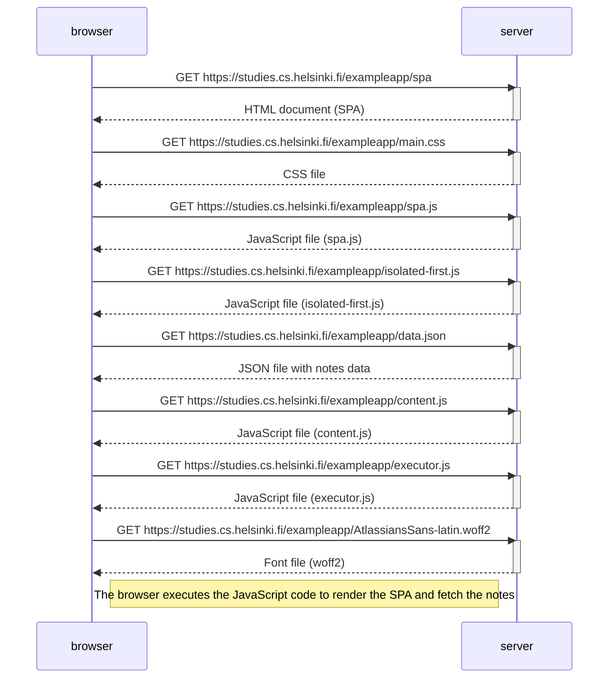

```mermaid
sequenceDiagram
    participant browser
    participant server

    browser->>server: GET https://studies.cs.helsinki.fi/exampleapp/spa
    activate server
    server-->>browser: HTML document (SPA)
    deactivate server

    browser->>server: GET https://studies.cs.helsinki.fi/exampleapp/main.css
    activate server
    server-->>browser: CSS file
    deactivate server

    browser->>server: GET https://studies.cs.helsinki.fi/exampleapp/spa.js
    activate server
    server-->>browser: JavaScript file (spa.js)
    deactivate server

    browser->>server: GET https://studies.cs.helsinki.fi/exampleapp/isolated-first.js
    activate server
    server-->>browser: JavaScript file (isolated-first.js)
    deactivate server

    browser->>server: GET https://studies.cs.helsinki.fi/exampleapp/data.json
    activate server
    server-->>browser: JSON file with notes data
    deactivate server

    browser->>server: GET https://studies.cs.helsinki.fi/exampleapp/content.js
    activate server
    server-->>browser: JavaScript file (content.js)
    deactivate server

    browser->>server: GET https://studies.cs.helsinki.fi/exampleapp/executor.js
    activate server
    server-->>browser: JavaScript file (executor.js)
    deactivate server

    browser->>server: GET https://studies.cs.helsinki.fi/exampleapp/AtlassiansSans-latin.woff2
    activate server
    server-->>browser: Font file (woff2)
    deactivate server

    Note right of browser: The browser executes the JavaScript code to render the SPA and fetch the notes

```

    Note right of browser: The browser executes the callback function that renders the notes
